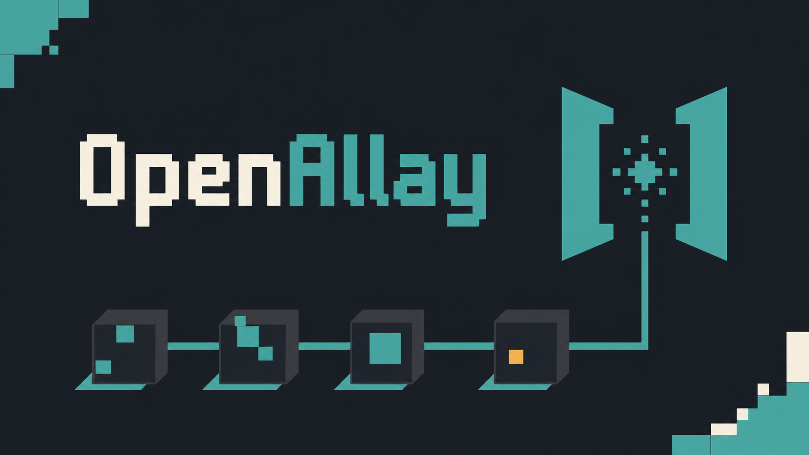

# OpenAllay

[简体中文](README.zh-CN.md)

OpenAllay is a modern Minecraft Agent for modded play. Ask a question in plain
language and it can look at your game, search recipes and guides, check your
inventory, and bring the useful details together in one answer.

It works with the model you choose and is designed to grow with knowledge and
integrations created by players, modpacks, and communities.

*Ask naturally, follow the progress, and explore rich answers without leaving
Minecraft.*

## Why OpenAllay?

### Answers grounded in your game

OpenAllay does more than generate Minecraft-flavoured text. It can inspect the
mods and settings in your current instance, search recipes and guide books, and
compare recipe requirements with the items you actually have. For more involved
questions, it can work through several steps before giving you an answer.

### A native in-game experience

Answers can include item icons, ingredient slots, recipe layouts, tables,
progress steps, and expandable details. The screen stays responsive while an
answer is being prepared, and you can close it without cancelling the request.

### Your model, your choice

Connect an OpenAI-compatible Chat Completions or Anthropic Messages provider,
keep several model profiles, and switch between them from the conversation.
OpenAllay works in single-player and can also be used on ordinary multiplayer
servers without requiring the server to install the mod. A server that does
install OpenAllay may offer a shared model to its players.

### Conversations that stay useful

Keep different topics in separate sessions, return to saved conversations,
copy useful messages, or export a session for later. Skills give OpenAllay
extra guidance for particular activities, mods, and kinds of questions, and
you can view or manage them in-game.

## What you can do today

- Find recipes and item uses, then check whether your inventory contains the
  required ingredients.
- Inspect installed mods, video settings, resource packs, coordinates, and
  F3-style information.
- Search supported guide-book content and local notes.
- Follow multi-step requests through live progress and friendly tool details.
- Use multiple conversations, saved history, model profiles, copy, and export
  from the native OpenAllay screen.
- Use recipe information from the game and compatible viewers, including JEI
  and REI, while keeping the core recipe experience available without them.

## Quick start

Download the OpenAllay snapshot for **Fabric** or **NeoForge** from Modrinth.
The current release targets Minecraft **26.2** and requires Java **25**. Fabric
players also need the matching Fabric API.

Place the downloaded JAR in your instance's `mods` folder and start Minecraft.
Then connect a model:

1. Enter a world and press **K**, or run `/guide`.
2. Select the gear button, open **Models**, and add a model profile.
3. Choose **OpenAI-compatible Chat Completions** or **Anthropic Messages**.
4. Enter the provider URL, model ID, context window, and API key, then save.
5. Select the new profile and start asking questions.

On Fabric, Architectury **21.0.2 and earlier** prevents text input on the
OpenAllay screen. Upgrade to **21.0.4 or newer**, or remove Architectury.

## Try asking

- “Which mods are installed, and what versions are they?”
- “How do I make apple cider? Do I already have the ingredients?”
- “What can I craft with this item?”
- “Why can't I find this recipe?”
- “Which resource packs are active?”
- “Show my current coordinates and F3 information.”
- “Search my installed guide books for magical crops.”

## Using the in-game screen

OpenAllay opens in a non-pausing Minecraft screen. The status bar shows what it
is doing and how long the current request has been running.

- **Enter** sends a message; **Shift+Enter** adds a new line.
- **Stop** cancels the current request; **Retry** starts it again.
- **Escape** closes only the screen. Reopen it to see the continuing answer.
- Use separate sessions for different topics, or switch to another configured
  model whenever you like.

## Mod and content support

OpenAllay builds on content already present in your modded instance:

- **JEI** recipes can use JEI's familiar layout inside OpenAllay.
- **REI** can contribute recipe information to OpenAllay's recipe experience.
- **Patchouli** guide-book content in active resources can be searched in-game.
- Recipe-rich mods such as **Farmer's Delight** work with recipe search,
  ingredient checks, and visual recipe pages.

These integrations are optional. OpenAllay remains usable when one of them is
not installed or is unavailable for your setup.

## Where OpenAllay is headed

OpenAllay is being developed as an open platform, but the larger platform is a
roadmap rather than a promise about the current snapshot:

- **OpenAllay Skills** will become easier for players and communities to
  create, improve, share, and discover.
- **OpenAllay Extensions** are planned to add community-built tools, knowledge
  sources, mod integrations, and game-native interface components.
- **OpenAllay Host** is the planned server experience for shared models and a
  centrally managed companion service.
- **OpenAllay Studio** is the future creative toolkit for richer in-game
  content, dynamic interfaces, and reusable guided experiences.

### Next

- Player memory that you can review, correct, pin, or forget.
- Better workflows for creating and sharing community Skills.
- More knowledge sources and integrations for mods, guides, and Minecraft
  content.
- The first supported paths for community Extensions.

### Longer term

- Understand maps, nearby environments, structures, blocks, and containers.
- Turn structures and documentation into step-by-step visual tutorials,
  including Ponder-style guidance when a compatible integration is available.
- Help plan production chains across machines, intermediate materials, and
  large technology trees.
- Grow OpenAllay Host, Studio, and the wider Extensions ecosystem.

OpenAllay is an independent project and is not affiliated with or endorsed by
Mojang Studios or Microsoft.

## Contributors and developers

Want to contribute or run the project from source? Start with the
[development guide](docs/development.md).

OpenAllay is licensed under the [MIT License](LICENSE).
